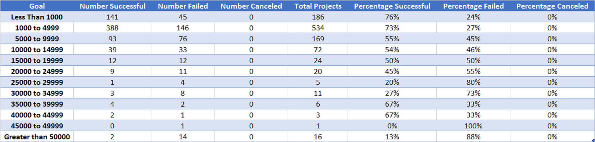

# Kickstarting with Excel

## Overview of Project
After Louise’s play *Fever* almost made her fundraising goal, she would like to learn more about various factors that could determine the outcome of the campaign. This project will analyze theater outcomes by launch date and outcomes based on goal amount. 

### Purpose
The purpose of this analysis is to visualize how different campaigns compared to their launch dates and their funding goals. The review of these two factors will be used to recommend Louise what she should do for her next fundraising campaign.

## Analysis and Challenges

### Analysis of Outcomes Based on Launch Date


The line chart below was created by a pivot table (above) that looked at launch dates and theater outcomes. The dates were then categorized by months of the year. Additional columns were created and filtered only the counts of successful, failed, and canceled outcomes. The chart also filtered out only outcomes related to theater. A line chart then was selected to compare these outcomes over time. This helped determine when it would be best to start a fundraising campaign. 


### Analysis of Outcomes Based on Goals


The line chart below was created by categorizing outcomes based on goal amount ranges in plays. First, a table (above) was created to extract the data from the Kickstarter sheet. Ranges started from $0 to $1,000, then increased by $5,000, and finally ended after goals that were greater than $50,000. The formula **COUNTIFS** was used to only count the outcomes of plays that met the goal range and outcome category. It was found that there were no canceled projects for plays. This allowed us to only look at the outcomes for successful versus failed plays. The total number of projects was then created by the **SUM** formula for each goal range. Next, the total number of projects was used to quantify what percentage of the outcome was met for each range. Finally, this table was used to create the line chart for Outcomes Based on Goals below. 


### Challenges and Difficulties Encountered
Throughout this project, I had two challenges: COUNTIFS and goal ranges. 

**COUNTIFS vs. COUNTIF:** Deliverable 2 - At the beginning I had a hard time understanding COUNTIFS. In my mind, I equated COUNTIFS to being a nested "COUNTIF." After playing around with the formula and research, I realized that COUNTIFS tested multiple criteria at once and only counts the cell if all criteria are met.  I thought it only tested one criterion at a time and stops at the first criteria that is met. 

**Goal Ranges:** Deliverable 2 - The last 2 ranges in the challenge instructions states “45,000 to 49,999” and “Greater than 50,000.” The “greater than” threw me off because I took that literally. The last range (Greater than 50,000) for number failed had this formula: 
```
 =COUNTIFS(Kickstarter!F:F,"Failed",Kickstarter!D:D,**">50000"**,Kickstarter!R:R,"plays"). 
```
The formula should have said, greater or *equal* to $50,000, shown below:
```
 =COUNTIFS(Kickstarter!F:F,"Failed",Kickstarter!D:D,**">=50000"**,Kickstarter!R:R,"plays"). 
```
Because I omitted the *equal to* part, there were 4 failed outcomes that did not count (with goals of $50,000). Under my number failed column, the total was incorrect after I checked my work. I kept coming up with 349 failed outcomes when it was supposed to add up to 353. After adding *equal to*, my total for number failed was correct.

## Results
- What are two conclusions you can draw about the Outcomes based on Launch Date?

Based the Outcomes based on Launch Date chart, we can conclude that between May and June is the best time to launch a fundraising campaign. Overall, the summertime seems to have more successful outcomes compared to the winter months.

- What can you conclude about the Outcomes based on Goals? 

It can be best concluded that a lower goal amount has a higher chance of a successful outcome ($0 to $4,999). Whereas goals between $5,000 and $24,999 have almost the same chances of succeeding or failing.   

- What are some limitations of this dataset?

Limitations of this dataset includes lack of feedback from donors, outliers, and inflation. 

Details from the fundraiser are great but there is no conclusive rationale as to why a fundraiser succeeded. Feedback from the donors would allow us to investigate what else would make a successful campaign. Another limitation could be outliers. This can be concluded from the percentage funded column. The color scale does not work because there is an outlier in the data, causing the data to be possibly skewed.  Lastly, there is a possibility of an inflation limitation on the monetary amounts. This data is from 2009 to 2017. Although it varies year to year, this can also be considered a limitation. In the U.S., $100 in 2009 is worth [$121.37](https://www.in2013dollars.com/us/inflation/2009?amount=100)  today (2020). According to the Bureau of Labor Statistics consumer price index, today's prices in 2020 are 21.37% higher than average prices since 2009.

- What are some other possible tables and/or graphs that we could create?

To meet Louise’s needs, most factors can be compared against either outcomes or percentage funded of theater or play projects. This can let her know what will make a successful fundraising campaign. One example could be a table of play outcomes against different countries. Louise can use this to see which countries favors plays more and campaign there. A bar graph can be created from this table. The second example could be the length of the campaign on outcomes. Do longer campaigns necessarily mean a better outcome? A line graph would be best to view the results. And lastly, perhaps it is best if the campaign was a staff pick. A bar graph could compare if that campaign were picked by a staff and their outcome. 

